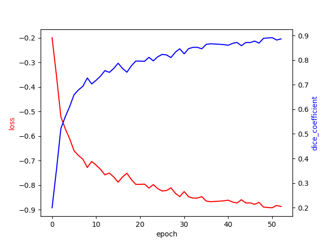

# Mouse Brain
Segmentation automatique du cerveau de souris à partir d'images IRM via un réseau neuronal U-NET.

### Données
La base de données initiale est composée de 16 images 3d labellisées de cerveaux de souris.

Nous l'augmentons en effectuant des symétries et rotation aléatoires.

### Environnement python
```bash
python -m venv venv
source venv/bin/activate
pip install -r requirements.txt
```

### Entrainement du modèle
```bash
python src/train.py
```
Le modèle est sauvegardé dans le fichier `models/unet3d-xxxxxx.h5`

### Evaluation du modèle
```bash
python src/test.py
```

### Résultats
Entrainement sur 10 epochs avec 128 données d'entrainements, et un batchsize de 4.

Coefficient dice : xx


